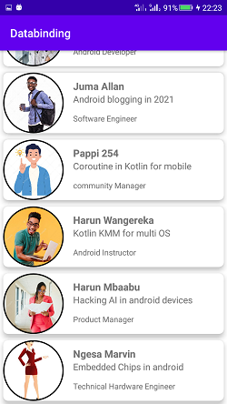

## Databinding-Kotlin

Using view Model, adapters , data class and view binding to build efficient UI and backend .

Databinding Kotlin GADS21
==================================

Simulating a speaker session profile using recyclerView in android and binding the views with adapters and viewHolder

Screenshot of final app
--------------

---------------------------
speaker1                                              |  speaker2
:----------------------------------------------------:|:-------------------------:
  |  
main activity                                         |  speaker3
    |  

Getting Started
---------------

1. clone the project starter code
2. follow the comments step by step  ( Binding)
3. Follow the onClick steps 
4. Learn how to pass the data ti the intent of speaker profile

